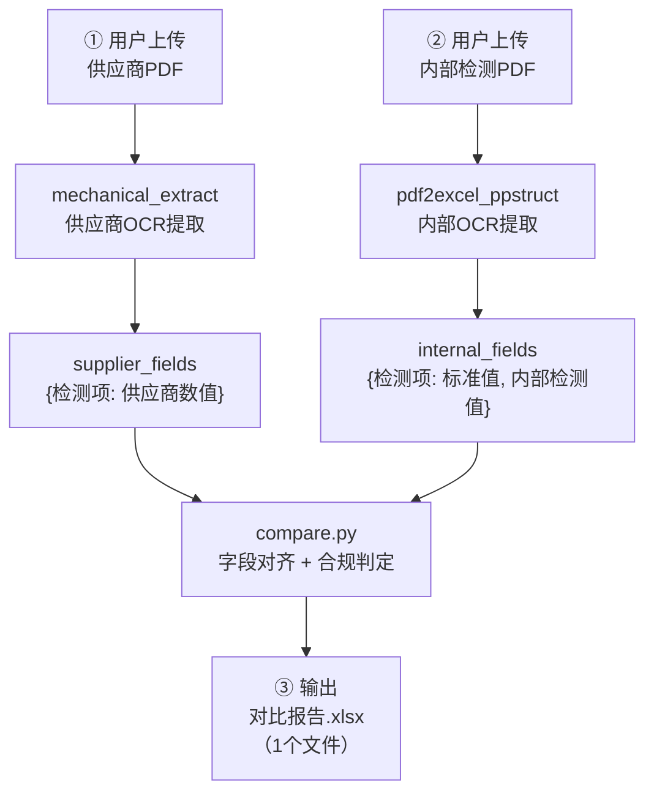
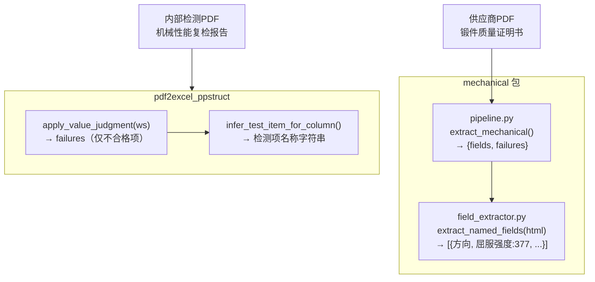

# 三方对比报告 — 设计方案

> 文档版本：2026-03-30  
> 目标：将供应商检测值、内部检测值、标准值三方合并，输出统一对比 Excel。

---

## 背景与目标

| 脚本 | 作用 | 输出 |
|------|------|------|
| `mechanical_extract.py` | 解析供应商质量证明书 PDF | 供应商检测值（屈服强度、抗拉强度等） |
| `pdf2excel_ppstruct.py` | 解析内部机械性能检测报告 PDF | 标准值 + 内部检测值 |

**当前缺失**：两份数据分开输出，无法直接对比。  
**目标**：新增对比流程，最终输出一张 7 列 Excel，包含：

```
检测项 | 标准值 | 供应商数值 | 内部检测值 | 是否合格 | 供应商不合格原因 | 内部不合格原因
```

---

## 需求描述

### 输入文件（2个）

#### 输入1：供应商文件
- **来源**：供应商随货附带的质量证明书，如「锻件质量证明书」
- **格式**：PDF 或图片（JPG / PNG）
- **内容**：包含机械性能表格，含屈服强度、抗拉强度、延伸率、冲击值、硬度等检测结果
- **处理脚本**：`mechanical_extract.py`（底层调用 `mechanical/pipeline.py`）
- **提取结果**：仅提取**供应商实测值**，不含标准值

#### 输入2：内部检测文件
- **来源**：内部质检部门出具的机械性能复检报告
- **格式**：PDF 或图片（JPG / PNG）
- **内容**：包含「要求值（标准）」行和「实测值」行，对应相同检测项
- **处理脚本**：`pdf2excel_ppstruct.py`（底层调用 PPStructureV3）
- **提取结果**：同时提取**标准值**（要求值行）和**内部实测值**（试样行）

> 两个输入文件**独立上传**，分别经各自的 OCR 流程处理后，再合并对比。

### 输出文件（1个）

- **格式**：Excel（`.xlsx`）
- **文件名**：`对比报告_{供应商文件名}_{时间戳}.xlsx`
- **存放位置**：用户指定的输出目录
- **内容**：单张 Sheet，7 列，每行对应一个检测项

```
检测项 | 标准值 | 供应商数值 | 内部检测值 | 是否合格 | 供应商不合格原因 | 内部不合格原因
```

### 完整业务流程



### 字段对齐规则

两个输入文件中的检测项名称可能存在 OCR 差异（如"屈服强度 Yield Strength ReL Mpa" vs "屈服强度"），需通过 `MECH_FIELD_PATTERNS` 规范化后，以**标准字段名**为主键进行匹配：

| 标准字段名 | 可能的 OCR 识别文本 |
|-----------|-------------------|
| 屈服强度 | 屈服强度、Yield Strength、ReL、Rp0.2 |
| 抗拉强度 | 抗拉强度、Tensile Strength、Rm |
| 延伸率 | 延伸率、伸长率、断后伸长率、Elongation |
| 冲击值 | 冲击值、冲击吸收能量、冲击功、Impact Value、AKV |
| 硬度HBW | HBW |
| 硬度HRC | HRC |

### 合规判定规则

| 情况 | 是否合格 | 说明 |
|------|---------|------|
| 供应商✓ 内部✓ | **合格** | 两者均满足标准 |
| 供应商✗ 内部✓ | **不合格** | 供应商不合格原因填写，内部原因填"—" |
| 供应商✓ 内部✗ | **不合格** | 内部不合格原因填写，供应商原因填"—" |
| 供应商✗ 内部✗ | **不合格** | 两列原因均填写 |
| 任一方数据缺失 | **待确认** | 黄色背景，人工复核 |

### GUI 界面需求

```
┌─────────────────────────────────────────────┐
│  三方对比报告生成工具                           │
├─────────────────────────────────────────────┤
│  供应商文件：[路径输入框]  [选择文件…]           │
│  内部检测文件：[路径输入框]  [选择文件…]         │
│  输出目录：[路径输入框]  [选择目录…]  [打开目录]  │
├─────────────────────────────────────────────┤
│  [▶ 开始生成]  [■ 停止]  □ 自动去除公章        │
│  ████████████████  进度条                    │
├─────────────────────────────────────────────┤
│  运行日志                                     │
│  ...                                         │
└─────────────────────────────────────────────┘
```

---

## 现有数据结构梳理



**关键缺口**：`pdf2excel_ppstruct.py` 的 `apply_value_judgment` 只返回不合格项，缺少「全量结构化提取（含合格项）」，需新增函数。

---

## 新增文件清单

### 1. `mechanical/internal_extractor.py`（新建）

从内部检测报告的 worksheet 中提取全量结构化字段：

```python
def extract_internal_fields(ws) -> list[dict]:
    """
    从已写入的 worksheet 提取所有检测项。
    返回: [{"检测项": "屈服强度", "标准值": "≥355", "内部检测值": "410"}, ...]
    """
    # 1. 找「要求值/Standard」行 → req_row, req_vals
    # 2. 找试样数据行（首列匹配 \d{2,}[-–]\d{4,}）→ actual_vals
    # 3. 对每个有 req 的列：infer_test_item_for_column → field_name
    # 4. match_to_standard_name(field_name) → 规范字段名（用 MECH_FIELD_PATTERNS 匹配）
    # 5. 返回 {检测项, 标准值, 内部检测值}

def match_to_standard_name(raw: str) -> str | None:
    """将 OCR 表头（如'屈服强度 Yield Strength ReL Mpa'）映射到标准字段名（'屈服强度'）"""
    # 遍历 MECH_FIELD_PATTERNS，找第一个匹配的字段名
```

### 2. `mechanical/compare.py`（新建）

合并两个来源，产生对比行并写入 Excel：

```python
def build_comparison(
    supplier_fields: list[dict],   # from extract_named_fields
    internal_fields: list[dict],   # from extract_internal_fields
) -> list[dict]:
    """
    按字段名对齐，返回对比列表：
    [{"检测项", "标准值", "供应商数值", "内部检测值", "是否合格", "供应商不合格原因", "内部不合格原因"}, ...]
    """

def write_comparison_excel(rows: list[dict], output_path: str):
    """写入6列对比Excel，不合格行红色标注"""
```

**字段名对齐策略**：以 `MECH_FIELD_PATTERNS` 的标准名（"屈服强度"、"抗拉强度"等）为主键，两侧均规范化后 join。

**判定逻辑**：
- 供应商/内部各自与标准值比对（复用 `mechanical/judgment.py` 的 `check_value`）
- `是否合格` = 两者均合格才写"合格"，否则"不合格"
- `供应商不合格原因` = 供应商值不满足标准时填写原因（如"377<355"），合格则填"—"
- `内部不合格原因` = 内部检测值不满足标准时填写原因（如"498<510"），合格则填"—"

### 3. `mechanical/compare_pipeline.py`（新建）

完整流程编排，串联两个 PDF 的处理结果：

```python
def run_comparison(
    supplier_pdf: str,
    internal_pdf: str,
    output_dir: str,
    remove_stamp: bool = True,
) -> str:   # 返回输出 xlsx 路径
    """
    1. extract_mechanical(supplier_pdf)  → supplier_fields
    2. OCR 内部检测 PDF → worksheet → extract_internal_fields → internal_fields
    3. build_comparison + write_comparison_excel → 对比 xlsx
    """
```

内部 PDF 的 OCR 部分**复用** `mechanical/ocr_engine.py` 和 `mechanical/preprocess.py`，**不依赖** `pdf2excel_ppstruct.py`。

### 4. `compare_extract.py`（新建，入口脚本）

CLI + GUI 双模式，结构仿 `mechanical_extract.py`：

```bash
# CLI 模式
python compare_extract.py -s 供应商.pdf -n 内部检测.pdf -o output/

# GUI 模式（无参数启动）
python compare_extract.py
```

GUI 包含两个文件选择框（供应商 PDF / 内部检测 PDF）及输出目录选择。

---

## 输出 Excel 格式

| 检测项 | 标准值 | 供应商数值 | 内部检测值 | 是否合格 | 供应商不合格原因 | 内部不合格原因 |
|--------|--------|-----------|-----------|---------|----------------|---------------|
| 屈服强度 | ≥355 | 377 | 410 | 合格 | — | — |
| 抗拉强度 | ≥510 | 522 | 498 | 不合格 | — | 498<510 |
| 延伸率 | ≥22 | 29 | 25 | 合格 | — | — |
| 冲击值 | ≥27 | 107/109/126 | 89/92/88 | 合格 | — | — |
| 硬度HBW | 143~187 | 164 | 170 | 合格 | — | — |

- 不合格行：红色背景 `#FFCCCC`
- 表头行：灰色背景 `#D9D9D9` + 加粗

---

## 修改文件清单

| 文件 | 操作 | 说明 |
|------|------|------|
| `mechanical/internal_extractor.py` | **新建** | 内部检测全量字段提取 |
| `mechanical/compare.py` | **新建** | 字段对齐 + 判定 + Excel 输出 |
| `mechanical/compare_pipeline.py` | **新建** | 双 PDF 流程编排 |
| `compare_extract.py` | **新建** | CLI + GUI 入口 |
| `mechanical/__init__.py` | **修改** | 新增 `run_comparison` 导出 |
| `mechanical/constants.py` | 不修改 | 复用 `MECH_FIELD_PATTERNS` |
| `pdf2excel_ppstruct.py` | **不修改** | 内部提取逻辑在新模块中独立实现 |

---

## 任务拆解

- [ ] **c1** 新建 `mechanical/internal_extractor.py` — 从内部检测 worksheet 提取全量字段（含标准值+实测值）
- [ ] **c2** 新建 `mechanical/compare.py` — 字段名对齐、合规判定、写 6 列对比 Excel
- [ ] **c3** 新建 `mechanical/compare_pipeline.py` — 串联两个 PDF 的 OCR 提取与对比流程
- [ ] **c4** 新建 `compare_extract.py` — CLI + GUI 入口（双文件选择）
- [ ] **c5** 更新 `mechanical/__init__.py` — 导出 `run_comparison`
